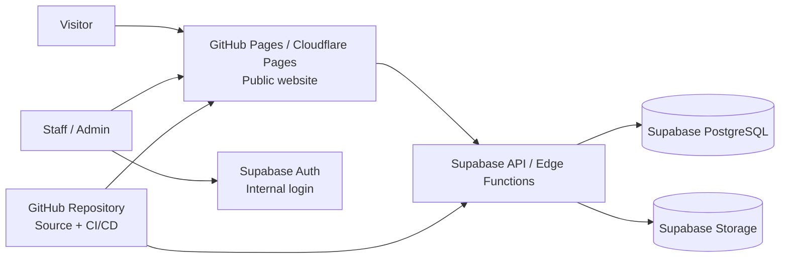
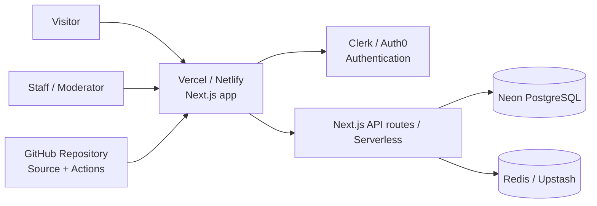
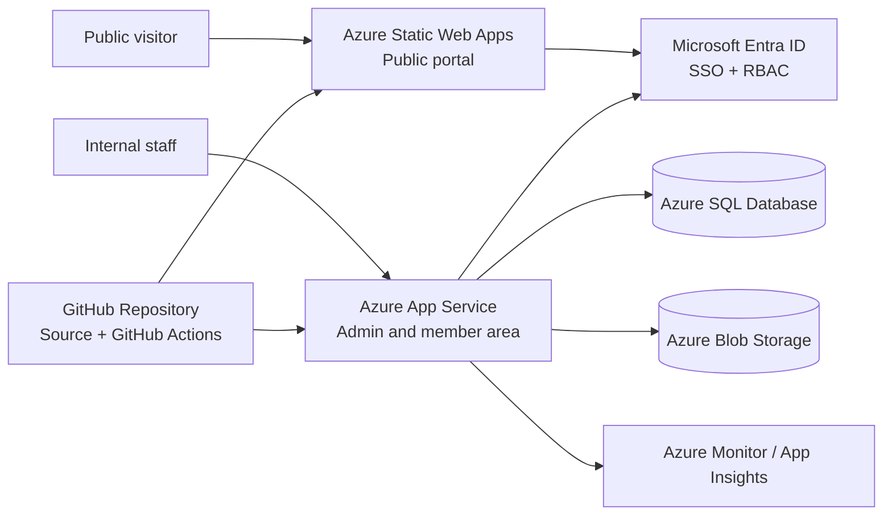
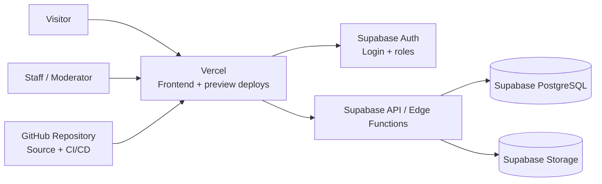
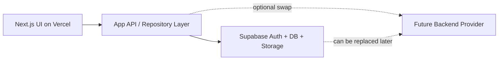

# Design

This document captures three possible setup examples for a community website where locals can describe the area for outsiders and share internal information securely.

The codebase will live in GitHub. Each example below shows a container-level view, hosting choice, security guidance, and data-store suggestion.

---

## Example 1: Low-cost public portal

Best fit when the site is mostly public content, with a small internal area for staff or volunteers.

### Container diagram

### Suggested stack
- Hosting: GitHub Pages or Cloudflare Pages for low-cost static/public delivery.
- App runtime: Static site + lightweight API or serverless functions.
- Security: GitHub branch protection, HTTPS, Supabase Row-Level Security, MFA for admins.
- Data store: Supabase PostgreSQL for content and user roles; Supabase Storage for images/files.

### Good fit
- Small community team
- Simple publishing flow
- Low operating cost

---

## Example 2: Managed full-stack application

Best fit when the site needs richer content, user roles, search, and a more polished admin experience.

### Container diagram

### Suggested stack
- Hosting: Vercel or Netlify for easy deployments and previews.
- App runtime: Next.js or similar framework with server-side rendering and API routes.
- Security: OAuth providers, role-based access, environment secrets in provider vaults, rate limiting.
- Data store: Neon PostgreSQL for structured content; optional Redis for cache and sessions.

### Good fit
- Medium-sized community site
- Frequent content updates
- Need for preview environments and simple CI/CD

---

## Example 3: Enterprise-style private + public split

Best fit when internal information must be strongly protected and the public site needs reliable scaling.

### Container diagram

### Suggested stack
- Hosting: Azure Static Web Apps for public pages and Azure App Service for internal/admin features.
- App runtime: ASP.NET Core, Node.js, or Python service layer.
- Security: Microsoft Entra ID, private networking where needed, TLS, secrets management, audit logs.
- Data store: Azure SQL Database for structured records; Azure Blob Storage for documents and media.

### Good fit
- Strong security requirements
- Mixed public + internal workflows
- Larger team or compliance needs

---

## Recommendation

Start with Example 1 if the goal is fast delivery and low cost. Move to Example 2 when richer content and admin workflows are needed. Choose Example 3 when internal data sensitivity and governance are primary concerns.

## Notes for GitHub-based delivery
- Keep source in GitHub.
- Use GitHub Actions for build, test, and deployment.
- Protect main branch with required reviews.
- Store secrets in the hosting platform vault, not in code.

## Decision: Vercel + Supabase

This setup combines Vercel for the web application and Supabase for authentication, database, and storage. It is a strong choice when you want a modern managed stack without building a custom backend from scratch.

### Container diagram

### Pros
- Fast setup with managed hosting and managed backend
- Good developer experience with GitHub + Vercel + Supabase integration
- Strong security options via Supabase Auth and Row-Level Security
- Easy storage for images, documents, and media
- Suitable for both public and internal content flows

### Cons
- More services to manage than a simple static site
- Requires careful database and RLS policy design
- Some advanced custom backend logic may still need serverless functions or API routes
- Costs can increase as usage, storage, and auth volume grow

### Good fit
- Teams that want a modern managed stack
- Projects with mixed public and internal content
- Small to medium communities that need secure data and quick delivery

### Future portability

- The frontend can be kept mostly independent from Supabase.
- Business logic should be isolated behind small API or repository functions.
- This makes it easier to replace Supabase later with another backend without rewriting the whole application.

---